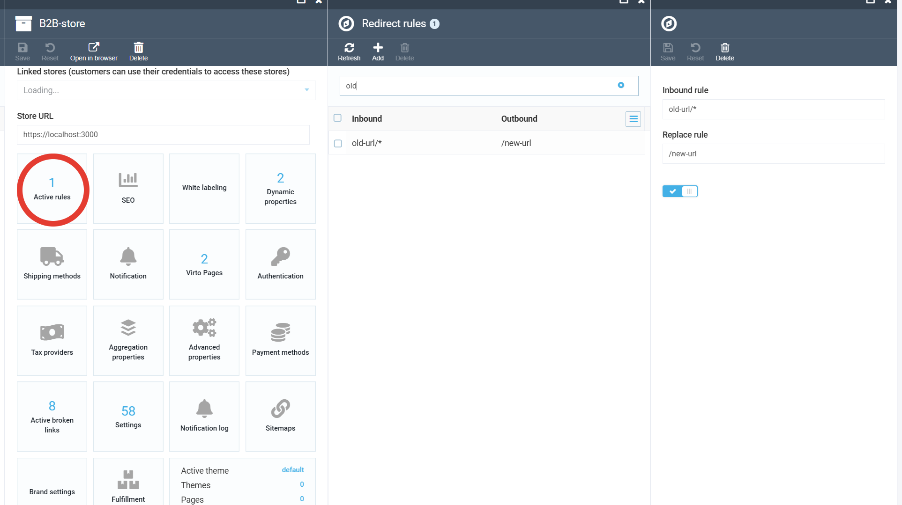

# SEO Module

The **VirtoCommerce SEO Module** provides a flexible infrastructure for managing SEO-related data across the platform. It supports SEO metadata (e.g., slugs, titles, meta descriptions) for various entities such as catalogs, categories, products, and custom pages.

## Key Features

- **SEO Info Lookup**: Efficient retrieval of SEO records matching given criteria such as `permalink`, `storeId`, `language`, and others.
- **Best Match Resolution**: Logic to determine the most relevant SEO entry when multiple matches are found.
- **Duplicate Detection**: Extensible interface `ISeoDuplicatesDetector` for identifying and resolving conflicting SEO entries.
- **Broken Links Detection and management** : Identify and report dead or misconfigured SEO links.
- **Custom rewrite rules**: detect inbound requests by rules and return redirectUrl.
- **Debug Seo links**: explain and troubleshoot permalink resolving using Debug SEO link widget.

## Configuration

Currently, the only configurable setting is the priority order for resolving SEO entries when multiple matches exist for a given permalink.

Use the following configuration key:

```
Seo:SeoInfoResolver:ObjectTypePriority
```

### Default value:

```
"Pages", "ContentFile", "Catalog", "Category", "CatalogProduct"
```

This setting defines the precedence for resolving SEO entries. For example, if both a `Page` and a `Category` are associated with the same permalink, the system will prioritize and display the `Page` because it has higher priority in the list.

## Important note

The SEO module does not affect server-side routing or HTTP status codes (such as 301 redirects). In a storefrontless architecture, all incoming requests are handled the same way — the server always returns the initial page of the SPA frontend. Then, the frontend determines what to display using the getSlugInfo GraphQL query.

The SEO module affects the result of getSlugInfo, meaning it informs the frontend which page type should be shown for a given URL and whether a client-side redirect should happen (e.g., from `/old-url` to `/new-url`). However, it does not affect what the server returns, and cannot trigger server-side HTTP 301/302 redirects on its own.

If server-side redirects are required (with correct HTTP status codes), this currently needs to be handled at the frontend server level (e.g., via IIS, Nginx, or similar), or via edge middleware in the cloud (e.g., Azure Front Door, Cloudflare Workers, etc.).

Here is some info about it:

https://www.virtocommerce.org/t/virto-commerce-frontend-spa-architecture-for-seo-and-404-handling/793

## Rewrite rules

You can configure rewrite rules to intercept incoming requests and respond with a redirect to a new URL.



These rules are evaluated in the `getSlugInfo` GraphQL query. They are checked **before** attempting to resolve a general SEO object. If a matching rule is found, the user will receive a response containing a `redirectUrl`.

## Debug SEO link

This feature provides Content managers, QA, and Support engineers with a visual tool to analyze, explain, and troubleshoot permalink resolving within a specific store and language context. It helps to understand how SEO links are selected and resolved step by step.

Users can trace how the SEO resolver works internally, validate expected behavior, and identify issues related to:
* Incorrect SEO item filtering.
* Unexpected priority resolution.
* Missing or duplicated permalinks.

The Debug (Explain) Permalink Tool is implemented as either Store Widget or Rest API within the Virto Commerce Admin. It allows users to test permalink resolution for any store and understand the internal stages of the SEO link selection process.


### Resolution Stages
When the user clicks `Debug`, a new blade opens titled `Debug SEO Links Stages`. This blade displays the full step-by-step process of permalink resolution, including intermediate results and item counts at each stage.


Resolution Stages:

|Stage|Name|Description|Output|
|---|---|---|---|
|1|Original|Retrieves all SEO items found by the resolver. No filtering applied.|	All SEO items from DB.|
|2|Filtered|Filters SEO items by store and language rules.|	Items matching store & language.|
|3|Scored|Calculates numeric scores and object type priorities for each item.|	Items with assigned scores.|
|4|FilteredScore| Keeps only items with a positive score.|SEO items with score > 0.|
|5|Ordered|Orders remaining items by score and object type priority.|	Sorted list by priority.|
|6|Final|Selects the highest-priority SEO item as the resolved permalink.|	The final resolved SEO record.|

Each stage row displays the number of SEO items processed.
Clicking on a stage opens a detailed blade showing the items at that specific step.

## Future Enhancements
- UI for managing SEO priorities
- Integration with sitemap and robots.txt generation

## Documentation

* [SEO module user documentation]([https://docs.virtocommerce.org/platform/user-guide/push-messages/overview/](https://docs.virtocommerce.org/platform/user-guide/seo/overview/))
* [GraphQL API documentation](https://docs.virtocommerce.org/platform/developer-guide/GraphQL-Storefront-API-Reference-xAPI/Push-messages/overview/)
* [REST API](https://virtostart-demo-admin.govirto.com/docs/index.html?urls.primaryName=VirtoCommerce.PushMessages)
* [View on GitHub](https://github.com/VirtoCommerce/vc-module-seo/)

## References
* [Deployment](https://docs.virtocommerce.org/platform/developer-guide/Tutorials-and-How-tos/Tutorials/deploy-module-from-source-code/)
* [Installation](https://docs.virtocommerce.org/platform/user-guide/modules-installation/)
* [Home](https://virtocommerce.com)
* [Community](https://www.virtocommerce.org)
* [Download latest release](https://github.com/VirtoCommerce/vc-module-seo/releases)

## License
Copyright (c) Virto Solutions LTD.  All rights reserved.

This software is licensed under the Virto Commerce Open Software License (the "License"); you
may not use this file except in compliance with the License. You may
obtain a copy of the License at http://virtocommerce.com/opensourcelicense.

Unless required by the applicable law or agreed to in written form, the software
distributed under the License is provided on an "AS IS" BASIS,
WITHOUT WARRANTIES OR CONDITIONS OF ANY KIND, either express or
implied.

